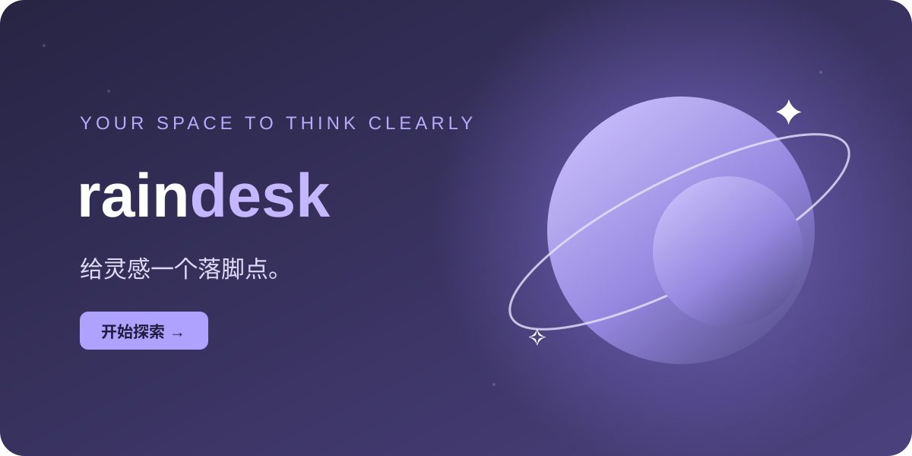

<p align="center"></p>

<h1 align="center">Rain Desk</h1>
<p align="center">给灵感一个落脚点，给重要的事一段安静时间。</p>
<p align="center"><a href="https://www.rainlove.work/rain/"><strong>在线使用</strong></a> · <a href="https://www.rainlove.work/projects/rain-desk/">博客介绍</a> · <a href="#本地运行">本地运行</a></p>

Rain Desk 是一个无需账号的个人工作台。想到的事先收集起来，选好下一步，再开始一轮专注。它是一组静态文件，可以直接放在任何静态站点上运行。

## 从想法到完成

| 步骤 | 在 Rain Desk 中做什么 |
| --- | --- |
| **01 · 收集** | 记下想法和补充说明，用优先级标记重要的事。 |
| **02 · 推进** | 把任务移到「正在进行」；桌面可拖放，手机可点箭头。 |
| **03 · 专注** | 选一件正在做的任务，开启 25/50 分钟计时；需要时暂停或休息 5 分钟。 |
| **04 · 回顾** | 查看任务完成进度、今日专注分钟和完成轮次。 |

任务还支持编辑、删除、全文搜索。计时中的页面即使刷新，也会根据结束时间恢复进度。

## 立即开始

直接打开[在线版](https://www.rainlove.work/rain/)。数据只保存在当前浏览器，第一次使用无需配置。

### 本地运行

仓库无需安装应用依赖，也没有构建步骤。克隆后用静态服务器打开根目录：

```bash
git clone https://github.com/lunch-rain/rain.git
cd rain
npx serve .
```

运行数据校验与计时恢复测试：

```bash
node --test
```

## 数据与隐私

- 任务、专注计时和每日专注记录保存在浏览器的 `localStorage`，不会自动上传到服务器。
- 「导出数据」下载 JSON 备份，包含任务及专注记录；导入时会先提示替换当前数据。旧版 v1 备份仍可导入，其中只有任务。
- 不同域名、浏览器、设备和无痕窗口不会自动共享数据。换设备或清理浏览器前，请先导出备份。

## 设计与参考

项目在 2026-09-26 和 2026-09-27 阅读 [GitHub Trending](https://github.com/trending?since=daily) 时逐步完善。以下项目启发了产品取舍和 README 的组织方式：

- [Paperclip](https://github.com/paperclipai/paperclip)：让目标、阶段与进展在同一个工作台里可见。
- [Hindsight](https://github.com/vectorize-io/hindsight)：重视跨次使用的上下文延续，因此专注计时可以从刷新中恢复。
- [OpenSpec](https://github.com/Fission-AI/OpenSpec)：把工作拆成清楚的阶段；Rain Desk 使用收集、进行、完成三列。
- [Impeccable](https://github.com/pbakaus/impeccable)：改善视觉层次，减少模板化的渐变与叠层卡片。

Rain Desk 的界面、代码和雨后窗景均为独立实现，没有复制上述项目的素材或代码。

## 许可

[MIT](./LICENSE)
